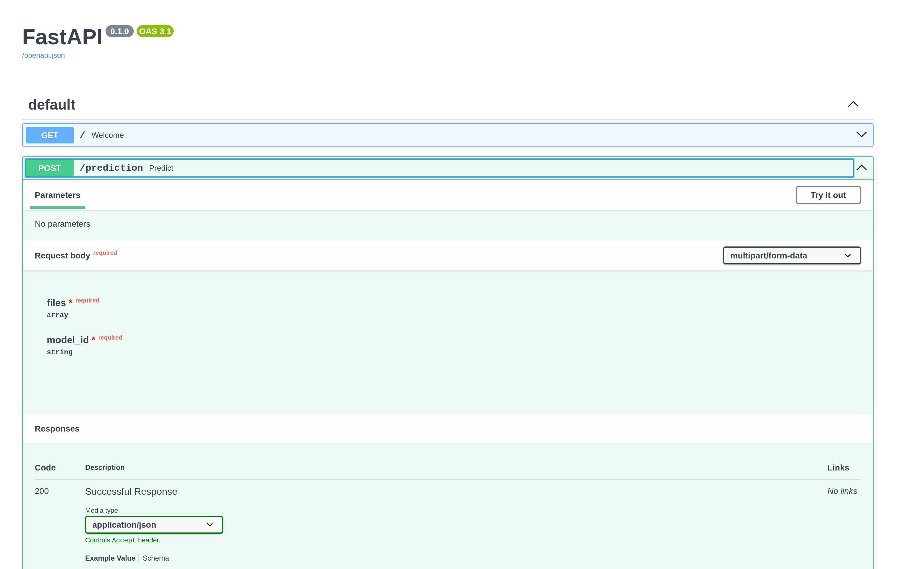

# MLServer Application for Model Endpoints

This is a FastAPI application containerized using Docker and Docker Compose.




## Prerequisites

- Docker: [Install Docker](https://docs.docker.com/get-docker/)
- Docker Compose: [Install Docker Compose](https://docs.docker.com/compose/install/)

## Getting Started

### Clone the Repository

```sh
git clone git@gitlab.com:deep-learning4541742/mlapp.git
cd mlapp
```

### Create a requirements.txt File
List all the dependencies your application needs. For example:

```txt
requests
numpy
torch
torchvision 
mlserver
```

### Dockerfile
Create a Dockerfile in the root of your project:

```docker
# Use the official Python image from the Docker Hub
FROM python:3.9-slim

# Set the working directory in the container
WORKDIR /app

# Copy the requirements file into the container
COPY requirements.txt .

# Install the dependencies
RUN pip install --no-cache-dir -r requirements.txt

# Copy the rest of the application code into the container
COPY . .

# Expose the port the app runs on
EXPOSE 8000

# Command to run the FastAPI application
CMD ["uvicorn", "serve_model:app", "--host", "0.0.0.0", "--port", "8003"]

```

### Docker Compose
Create a docker-compose.yml file in the root of your project:

```docker compose
version: '3.8'

services:
  serve-model:
    build: .
    ports:
      - "8003:8003"
    volumes:
      - .:/app
    environment:
      - PYTHONUNBUFFERED=1
```


### Build and Run the Docker Container
#### Using Docker Compose

To build and run the application using Docker Compose, run:

```sh
docker-compose up --build
```

#### Using Docker Directly
To build and run the application using Docker directly, run:

```bash
docker build -t server-model .
docker run -p 8003:8003 serve-model
```


### Access the Application
Once the container is running, you can access the FastAPI application at:

```txt
http://localhost:8003
```